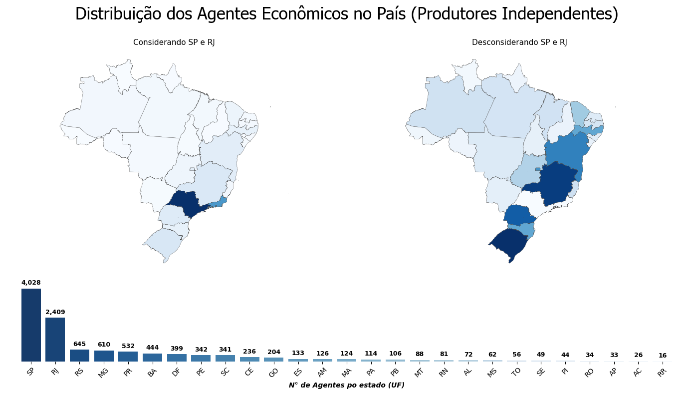

**Um Estudo sobre o perfil dos Agentes Econômicos da Indústria Cinematográfica Brasileira**

A indústria cinematográfica de um país reflete sua cultura, sociedade, aspirações e desafios. No Brasil, embora o setor seja ativo e produza muitos filmes anualmente, enfrenta forte concorrência do cinema estrangeiro, especialmente o norte-americano, que domina o mercado audiovisual graças a grandes orçamentos e apelo comercial.

Essa disparidade se agrava pela dificuldade que cineastas independentes e produções menores têm em acessar financiamento e distribuição, enquanto grandes estúdios contam com mais recursos. Políticas públicas e incentivos governamentais, como subsídios e financiamento, são fundamentais para fortalecer a produção nacional e ampliar a diversidade no cinema brasileiro.

Na ANCINE (Agência Nacional do Cinema), agentes econômicos são pessoas físicas ou jurídicas que atuam na cadeia produtiva audiovisual, abrangendo produtoras, distribuidoras, empresas exibidoras, programadoras e licenciamento.

O gráfico acima mostra a distribuição dos Agentes Econômicos no País 

📫 Contato
💼 LinkedIn
🐱 GitHub
📧 syafonseca@gmail.com
📝 Esta página é parte do meu portfólio pessoal, construída com GitHub Pages e Jekyll.